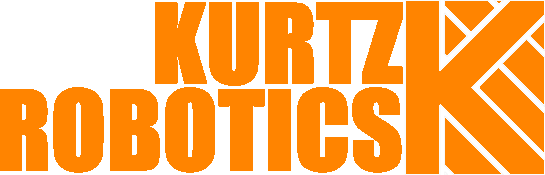
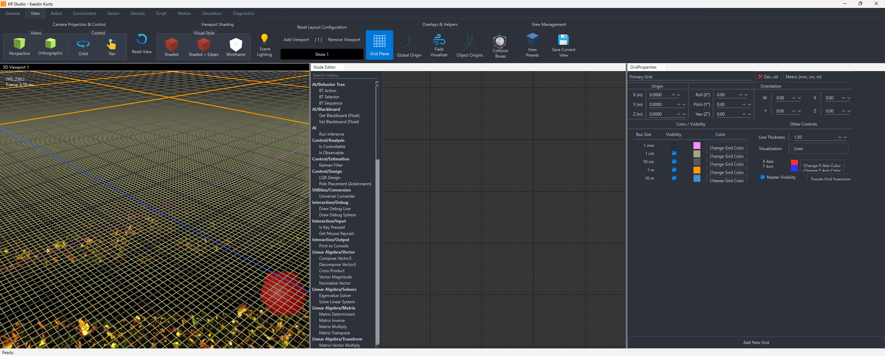

# KR Studio

> **Real-time robotics simulation, rendering, and control platform** — designed for high-fidelity visualization, flexible robotics workflows, and deep integration with physical hardware.

---

---

## 🎯 Overview

KR Studio merges **modern rendering pipelines** with **robotics simulation** and **database-driven asset management**.  
It’s not just a visualization tool — it’s a full **development environment** for building, testing, and refining robotics systems before committing to hardware.

---

## ✨ Features

### 🖥 Rendering
- **Deferred rendering pipeline** with geometry, lighting, and post-processing passes.
- **Physically Based Rendering (PBR)**:
  - HDR environment sampling
  - Image-Based Lighting (IBL) with irradiance & prefiltered cubemaps
  - BRDF LUT integration
- Advanced material system:
  - Albedo, metalness, roughness, AO, emissive
  - Refraction, reflectance, anisotropy (WIP)
- Debug-friendly: every pass is isolated for RenderDoc capture.

### 🧩 Multi-Viewport UI
- Built on **Qt** + **Advanced Docking System (ADS)**.
- Multiple independent viewports with separate cameras and rendering states.
- Persistent dock layouts per workspace.
- Toolbar/menu synchronization.

---

### 📦 Scene & Asset Management
- **SQLite** asset database with metadata tracking.
- On-demand mesh loading via **Assimp**.
- Hybrid CPU/GPU cache with automatic cleanup.
- Scene graph with fast lookup and lazy asset binding.

---

### 🛠 Node-Based Editing
- Powered by **QtNodes**.
- For logic graphs, material graphs, and procedural asset pipelines.
- Real-time updates directly in the viewport.

---

## 🧠 Architecture

    App Shell (Qt/ADS) --> Asset & Scene
    App Shell (Qt/ADS) --> Rendering System (OpenGL 4.5)
    Asset & Scene --> Rendering System (OpenGL 4.5)
    Asset & Scene --> Simulation & Robotics (WIP)
    Simulation & Robotics (WIP) --> Rendering System (OpenGL 4.5)
    Persistence & Services --> App Shell (Qt/ADS)
    Persistence & Services --> Asset & Scene
    Persistence & Services --> Rendering System (OpenGL 4.5)

📈 Development Roadmap
✅ Completed

Stable deferred rendering core
Multi-viewport rendering
HDR cubemap + BRDF LUT generation
SQLite asset management
Docking system persistence

🛠 In Progress

Parallax occlusion mapping (POM)
Selection outline without Z-fighting
Expanded material effects (refraction, translucency)
TAA refinement

📅 Planned

Physics integration (Bullet / PhysX)
Robotics IK & kinematics visualization
Procedural asset/material tools

📂 Repository Structure
/src
  /Rendering         → Passes, shaders, texture management
  /UI                → Qt docking system, toolbars, menus
  /Database          → SQLite handling, asset tracking
  /Simulation        → Robotics & physics integration (WIP)
  /Nodes             → Node-based editor
/shaders             → GLSL programs (PBR, post-processing)
/assets              → Sample/test assets
/docs                → Screenshots, diagrams

🔨 Build Instructions
Prerequisites
CMake ≥ 3.21
Qt ≥ 6.x
OpenGL ≥ 4.5 capable GPU

vcpkg for dependencies

git clone https://github.com/KaedinKurtz/KRStudio.git

cd KRStudio

cmake --preset windows-msvc-debug

cmake --build build

🔗 Related Projects

Bipedal Digitigrade Robot – Hardware platform KR Studio is built to simulate/control.

Actuator Test Bench – Standalone module for validating gearbox and motor designs.

📜 License
TBD — finalized on beta release.

📬 Contact
Author: Kaedin Kurtz
LinkedIn:[PrLinkedInofile](https://github.com/KaedinKurtz/)
